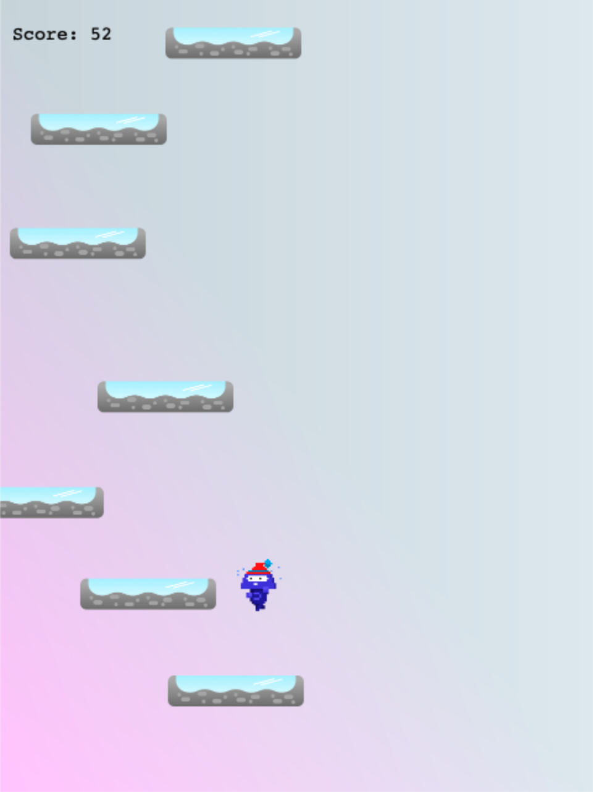

# Icy Jump

> A Platform based game with score sharing feature. Made with JavaScript Game library - Phaser 3.

## Screenshot

## Requirements

[Node.js](https://nodejs.org) is required to install dependencies and run scripts via `npm`.

## How To Play

Use left and right arrow keys to control the player. Land on the platform to stay alive. Player dies when falls on the ground.

## Built With

* Phaser 3
* Javascript (ES6)
* Sass
* Webpack
* Jest

## Available Commands

| Command | Description |
|---------|-------------|
| `npm install` | Install project dependencies |
| `npm start` | Build project and open web server running project |
| `npm run build` | Builds code bundle with production settings (minification, uglification, etc..) |
| `npm test` | Tests the applications |

## Live Demo

[Live Link](https://pensive-hopper-fc7d88.netlify.app/)

## Presentaion

[Video Presentation Link](https://www.loom.com/share/2267d2bd2d40453b858eedaaa252322e)

## Authors

**Muhammad Umar**
- Github: [@mohammadumar28](https://github.com/mohammadumar28)
- LinkedIn: [Mohammad Umar](https://www.linkedin.com/in/mohammadumar28/)
- Twitter: [@Mohammadumar28](https://twitter.com/Mohammadumar28)
- Email: [mohammadumar28@gmail.com](mailto:mohammadumar28@gmail.com)

## Acknowledgements

* [Microverse](https://microverse.org)

## Contribution

* Fork this repo.
* Create your feature branch `git checkout -b my-new-feature`.
* Commit your changes `git commit -am "Add some feature"`.
* Push to the branch `git push origin my-new-feature`.
* Create a new Pull Request.
